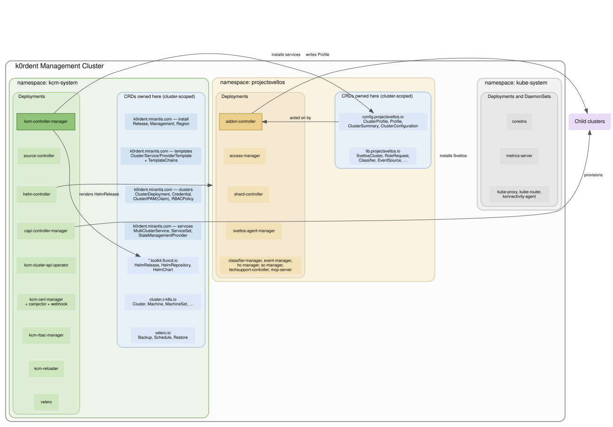

# Architecture

KCM turns declarative objects in a management cluster into running clusters and
running services on them. It does little of that work itself: it renders intent
into objects that Flux, Cluster API and Projectsveltos already know how to act
on, and then watches what they report back.

This document describes what runs in the management cluster.

## Workloads

Only the first two are KCM's own code. The rest are upstream components KCM
installs and then depends on.

| Workload | Role |
|---|---|
| **kcm-controller-manager** | Every KCM controller, plus the admission webhook server. Leader-elected, so one replica reconciles at a time. |
| **telemetry** | Collects usage data on a timer. Runs `disabled`, `local` (writes to a directory) or `online`; on `disabled` the deployment is not rendered at all, so an air-gapped install carries nothing extra. |
| **source-controller**, **helm-controller** (Flux) | Resolve chart references and install every `HelmRelease` KCM renders — provider components, cluster charts, templates. |
| **capi-controller-manager** + infrastructure providers | Provision and manage the lifecycle of child clusters. |
| **cluster-api-operator** | Installs and upgrades the CAPI providers themselves. |
| **addon-controller** (Projectsveltos) | Deploys services onto child clusters from the `Profile` objects KCM writes. |
| **cert-manager** | Certificates for the webhook server and for components that need them. |
| **velero** | Executes the backups `ManagementBackup` schedules. |
| **rbac-manager** | Reconciles the RBAC objects KCM declares. |
| **reloader** | Restarts components when their config or secrets change. |



One box per namespace, and inside each the workloads that run there alongside
the CRDs they own. CRDs are cluster-scoped, so they sit with their owner rather
than inside a namespace.

Only edges that cross a namespace are drawn — within one, nearly everything
talks to everything, and drawing that would say nothing.

## What kcm-controller-manager does

One process, many controllers. They fall into three groups.

**Installation.** Reconcile `Release`, `Management` and `Region` into a
`HelmRelease` per enabled provider component, and resolve `ClusterTemplate`,
`ServiceTemplate` and `ProviderTemplate` against their charts to decide whether
each is valid. A `Region` runs the same reconciliation against a second
cluster's client, so provider components sit closer to the infrastructure they
talk to.

**Cluster provisioning.** Validate a `ClusterDeployment` against its template's
schema, resolve the `Credential`, wait for any `ClusterIPAMClaim` to be bound,
and render a `HelmRelease` for the cluster chart — Flux installs it, the chart
creates the CAPI objects, CAPI provisions the cluster. Alongside this run the
supporting controllers for `Credential`, IPAM, `RBACPolicy`,
`AccessManagement` and `ManagementBackup`.

**Service delivery (KSM).** Turn a `MultiClusterService` into one `ServiceSet`
per matching cluster, respecting `dependsOn` and walking a
`ServiceTemplateChain` one hop at a time. A `StateManagementProvider` names the
adapter that takes it from there.

Admission webhooks enforce what the CRD schema cannot: that a template exists
and is valid, that a config matches its values schema, that an upgrade is
permitted by the chain, and that objects are not deleted while others still
depend on them.

## The service delivery seam

`ServiceSet` is where KCM stops being provider-specific. Above it nothing knows
what Sveltos is; below it the adapter inside `kcm-controller-manager` is the
only part that does. Swapping the delivery mechanism means writing another
adapter and another `StateManagementProvider`, not touching the controllers
that decide which services belong where.

A service counts as deployed only once Sveltos reports it *and* the adapter has
evaluated the health rules against the target cluster, because Helm can report
success before workloads are ready. Only then does the next hop of a
`ServiceTemplateChain`, or the next service in a `dependsOn` chain, start.

---

The diagram is generated from the Graphviz source next to this file:

```sh
dot -Tsvg docs/architecture.dot -o docs/architecture.svg
```
