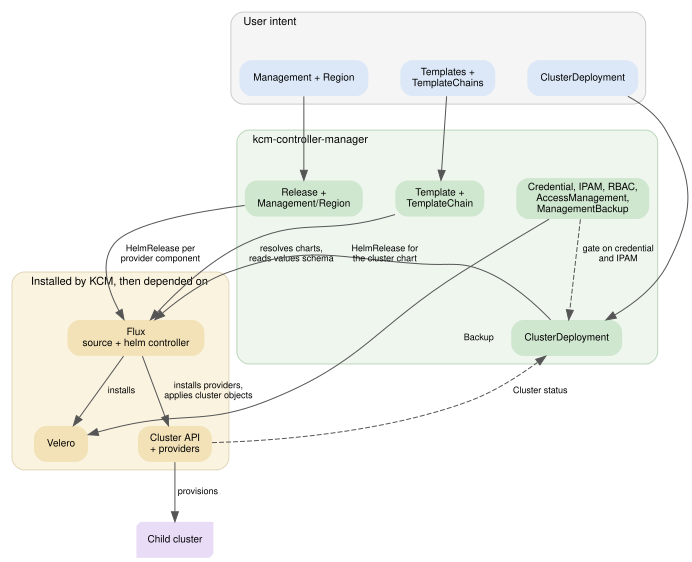
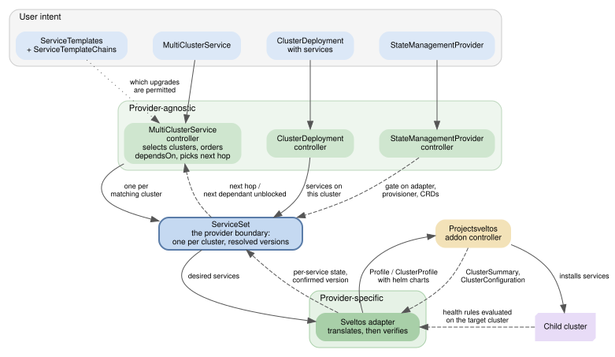

# Architecture

KCM turns declarative objects in a management cluster into running clusters and
running services on them. It does almost none of that work itself: it renders
intent into objects that Cluster API, Flux and a state-management provider
already know how to act on, and then watches what they report back.

Everything below runs in the management cluster unless stated otherwise.

## Processes

KCM ships as two binaries.

**`manager`** (`cmd/main.go`) is one controller-runtime manager hosting every
controller listed under [Controllers](#controllers), plus the admission webhook
server. Leader election means one replica reconciles at a time.

**`telemetry`** (`cmd/telemetry/main.go`) is a separate manager that periodically
collects usage data. It runs in one of three modes — `disabled`, `local` (writes
to a directory) or `online` — so an air-gapped installation can keep it off
without patching the deployment.

## Resources

KCM's CRDs (`api/v1beta1`) fall into four groups.

**Installation.** `Release` is a cluster-scoped manifest naming the exact chart
versions that make up one KCM version: the KCM chart itself, the regional chart,
Cluster API, and every provider. `Management` is the singleton that selects a
`Release` and lists which providers to enable. `Region` onboards a second cluster
so provider components run closer to the infrastructure they talk to, referencing
either a kubeconfig `Secret` or an existing `ClusterDeployment`.

**Templates.** `ClusterTemplate`, `ServiceTemplate` and `ProviderTemplate` each
wrap a Helm chart reference and carry the constraints KCM validates against.
`ClusterTemplateChain` and `ServiceTemplateChain` declare which upgrades are
permitted, as a set of supported templates with upgrade paths between them —
the chain is what makes a multi-hop upgrade walk its intermediate versions
instead of jumping.

**Cluster provisioning.** `ClusterDeployment` is the user-facing request for one
cluster: a `ClusterTemplate`, a `Credential`, and a config blob validated against
the template's schema. It optionally references `ClusterAuthentication`,
`ClusterAuditPolicy`, `RBACPolicy`, `DataSource` and an IPAM claim.
`Credential` points at a provider-specific identity object, whose shape is
declared by `ProviderInterface`. `ClusterIPAMClaim` and `ClusterIPAM` reserve
address space before the cluster is created.

**Service delivery (KSM).** `MultiClusterService` selects clusters by label and
declares services to run on them, with `dependsOn` ordering between services and
between `MultiClusterService` objects. `ServiceSet` is the per-cluster object
KCM derives from that — it is the boundary between KCM and whatever actually
deploys the services. `StateManagementProvider` names the adapter and the
provisioner behind that boundary, so the delivery mechanism is swappable.

## Controllers

### Installation

**Release controller** reconciles a `Release` into a flux `HelmRelease` for the
`kcm-templates` chart, which is what creates the `ClusterTemplate`,
`ServiceTemplate` and `ProviderTemplate` objects for that version. It also
bootstraps: on the initial install it renders that chart with `createRelease`
set, so the chart produces the first `Release` object, and it can create the
`Management` singleton — a fresh cluster therefore converges without anyone
applying either by hand.

**Management controller** reconciles the singleton `Management`. It resolves the
selected `Release`, then hands each enabled provider to the shared components
reconciler, which renders one flux `HelmRelease` per component and aggregates
their readiness back into `Management.status`. Removing a provider deletes its
`HelmRelease`; deleting `Management` optionally removes the provider CRDs.

**Region controller** does the same for a `Region`, but against the regional
cluster's client rather than the local one. Provider components, and the
`ClusterDeployment` reconciliation that depends on them, then happen there.

**Template controllers** (`ClusterTemplate`, `ServiceTemplate`,
`ProviderTemplate`) resolve each template's chart through Flux, read the values
schema and provider requirements out of it, and mark the template valid or not.
Nothing that references an invalid template proceeds.

**Template chain controllers** propagate the templates a chain names into the
namespaces where they are needed, so a `ClusterDeployment` can reference an
upgrade target that was defined centrally.

**AccessManagement controller** distributes templates and credentials into
tenant namespaces according to its access rules, which is how a namespace gets
the templates it is allowed to use without being given the whole catalogue.

### Cluster provisioning

**ClusterDeployment controller** is the main path. It validates the config
against the template's schema, resolves the credential, waits for any IPAM claim
to be bound, and renders a flux `HelmRelease` for the cluster chart. Flux
installs it, the chart creates the Cluster API objects, and CAPI provisions the
cluster. From there the controller tracks the CAPI `Cluster` and machines,
propagates credentials for the cloud controller manager when asked to, and
creates `ServiceSet` objects for any services the deployment declares.

**Credential controller** validates that the referenced identity object exists
and matches a `ProviderInterface`, and reports readiness — a `ClusterDeployment`
with a credential that is not ready does not proceed.

**IPAM controllers** reconcile `ClusterIPAMClaim` against a provider (in-cluster
or Infoblox), record the allocated addresses in `ClusterIPAM`, and gate cluster
creation until the claim is bound.

**RBAC controller** materialises an `RBACPolicy` into `ClusterRoleBinding`
objects inside each referencing cluster.

**ManagementBackup controller** drives Velero: on schedule, on demand, or once
before a `Management` upgrade. It builds the backup spec from what KCM knows is
part of the installation rather than from a fixed list.

### Service delivery (KSM)

The KSM layer is split deliberately: the parts that decide *what* should run are
provider-agnostic, and only the adapter knows how services actually get
deployed.

**MultiClusterService controller** matches clusters against `clusterSelector`,
respects `dependsOn` between `MultiClusterService` objects, and creates,
updates or deletes one `ServiceSet` per matching cluster. It also decides which
version each service should move to next: with a `ServiceTemplateChain` that
means the next hop along the chain, not the final target.

**StateManagementProvider controller** verifies that a provider's adapter,
provisioner and CRDs are all present and ready, and reports that on the object.
A `ServiceSet` referencing a provider that is not ready is not acted on.

**Sveltos adapter** (`internal/controller/adapters/sveltos`) is the only
component that knows about Sveltos. It translates a `ServiceSet` into a Sveltos
`Profile` (or `ClusterProfile` for the management cluster itself), then reads
`ClusterSummary` and `ClusterConfiguration` back to report per-service state.
Because Helm can report success before workloads are ready, the adapter
cross-checks the resources on the target cluster against health rules before it
records a service as deployed, and fingerprints the chart identity and values so
it can tell a confirmed deployment from one still rolling out.

**Sveltos cluster controller** keeps `SveltosCluster` objects in step with the
clusters KCM knows about, so Sveltos can target them.

### Admission

Validating webhooks (`internal/webhook`) enforce what cannot be expressed in the
CRD schema: that a template exists and is valid, that a config matches the
template's values schema, that an upgrade is permitted by the chain, that a
provider is enabled before something references it, and that objects are not
deleted while others still depend on them.

## External components

KCM installs and then depends on these, rather than reimplementing them.

| Component | Role |
|---|---|
| **Flux** (source-controller, helm-controller) | Resolves chart references and installs every `HelmRelease` KCM renders — provider components, cluster charts, templates |
| **Cluster API** + infrastructure providers | Provisions and manages the lifecycle of child clusters |
| **Cluster API Operator** | Installs and upgrades the CAPI providers themselves |
| **Projectsveltos** | Deploys services onto child clusters from the `Profile` objects the adapter writes |
| **cert-manager** | Certificates for the webhook server and for components that need them |
| **Velero** | Executes the backups `ManagementBackup` schedules |
| **rbac-manager** | Reconciles the RBAC objects KCM declares |
| **Reloader** | Restarts components when their config or secrets change |

## How the pieces fit

Two diagrams rather than one, because KCM runs two pipelines with different
shapes: one gets components and clusters installed, the other keeps services
running on them.

### Installation and cluster provisioning



Almost every arrow out of the manager is a `HelmRelease`. KCM decides *what*
should be installed and hands the *how* to Flux, and from there to Cluster API.

### Service delivery



`ServiceSet` is the seam. Above it nothing knows what Sveltos is; below it the
adapter is the only component that does. Swapping the delivery mechanism means
writing another adapter and another `StateManagementProvider`, not touching the
controllers that decide which services belong where.

The dashed edges are the important part: a service counts as deployed only once
Sveltos reports it *and* the adapter has evaluated the health rules against the
target cluster, because Helm can report success before workloads are ready.
Only then does the next hop of a chain, or the next service in a `dependsOn`
chain, start.

Both diagrams are generated from Graphviz sources next to this file:

```sh
dot -Tsvg docs/architecture-install.dot -o docs/architecture-install.svg
dot -Tsvg docs/architecture-ksm.dot     -o docs/architecture-ksm.svg
```

## Two flows worth following

**Creating a cluster.** A `ClusterDeployment` is admitted only if its
`ClusterTemplate` is valid and its config matches the template's schema. The
controller resolves the `Credential`, waits for any `ClusterIPAMClaim` to be
bound, and writes a `HelmRelease`. Flux installs the cluster chart; the chart
creates CAPI objects; CAPI provisions the machines. The controller watches the
CAPI `Cluster` and reflects its readiness. Once the cluster exists, services
declared on the deployment become a `ServiceSet`.

**Deploying a service.** A `MultiClusterService` selects clusters and produces
one `ServiceSet` each, holding the resolved version of every service — the next
hop along the `ServiceTemplateChain` when there is one, the requested version
when there is not. The adapter named by the `StateManagementProvider` turns that
into a Sveltos `Profile`. Sveltos installs the charts and reports back through
`ClusterSummary`; the adapter verifies the workloads on the target cluster
before recording a version as deployed. Only then does the next hop, or the next
service in a `dependsOn` chain, begin.
